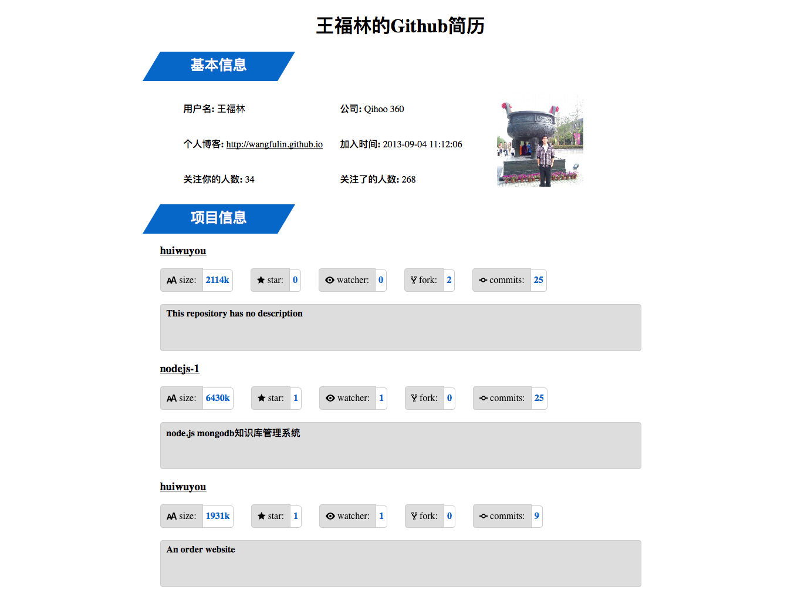

## 项目地址：[Github-Helper](https://github.com/wangfulin/Github-Helper)

相信程序员对 Github 都不会陌生，你的 Github 也是自己的简历，在 Github 的贡献越大，对求职的帮助就越大，也能够慢慢增加自己的影响力。这个项目的目的就是根据自己在 Github 的贡献情况生成自己独特的简历。欢迎 fork, 你可以为自己的简历设置自己的样式，也可以进一步加入其它功能。

## 使用的框架

[Thinkjs](https://github.com/75team/thinkjs)

## 使用的插件

[github-api](https://github.com/michael/github)

## 如何使用

1. `npm install`

2. `npm start`

## 使用 pm2 发布到生产环境

1. `pm2 startOrReload pm2.json`

## 截图

1. 输入 Github 用户名 

2. 生成 Github 简历

